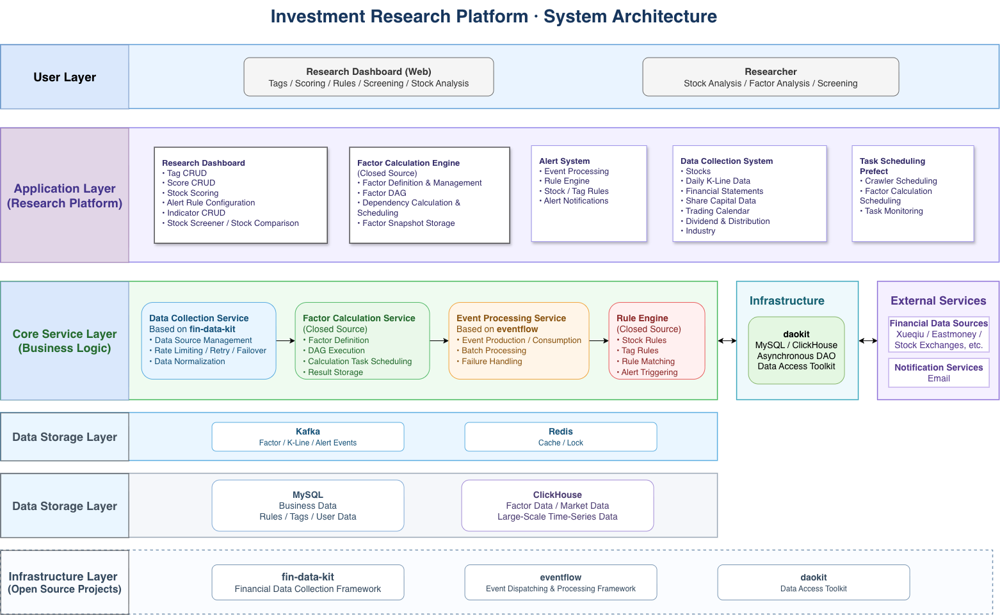
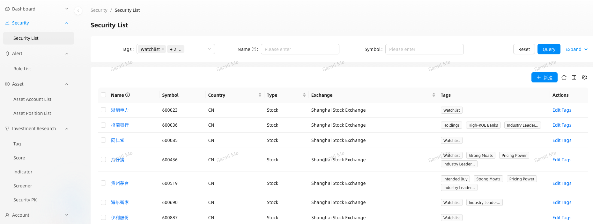
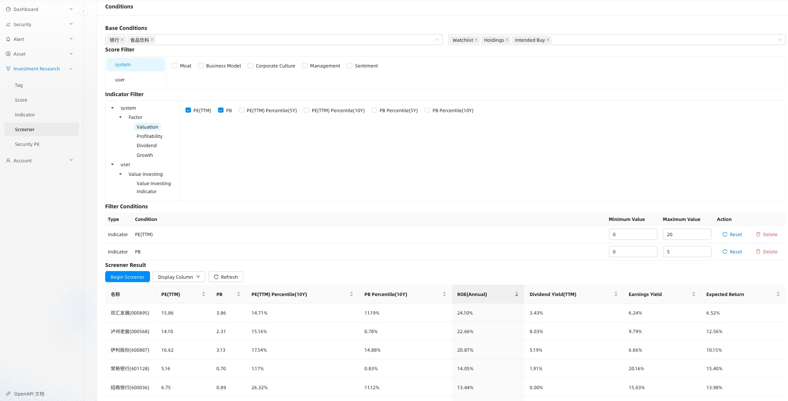
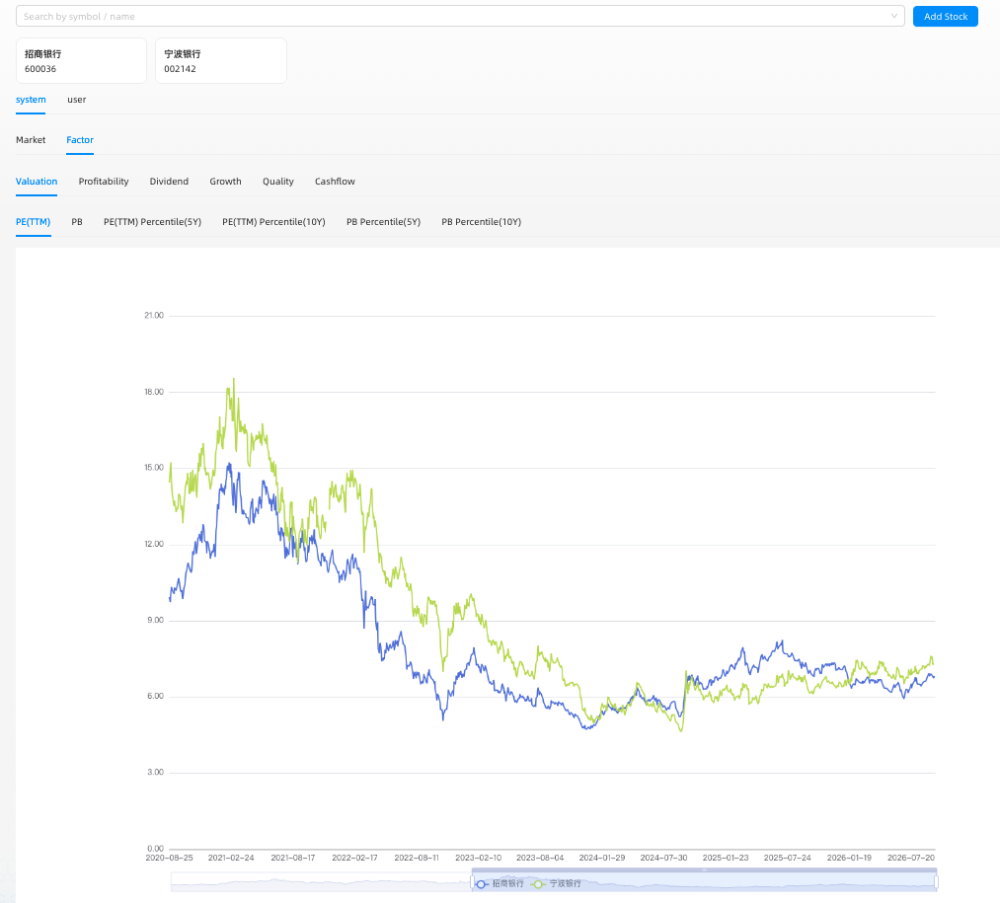
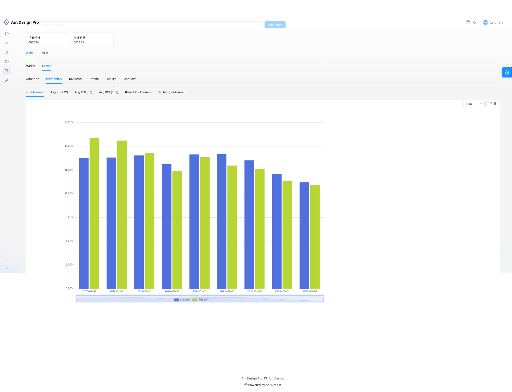
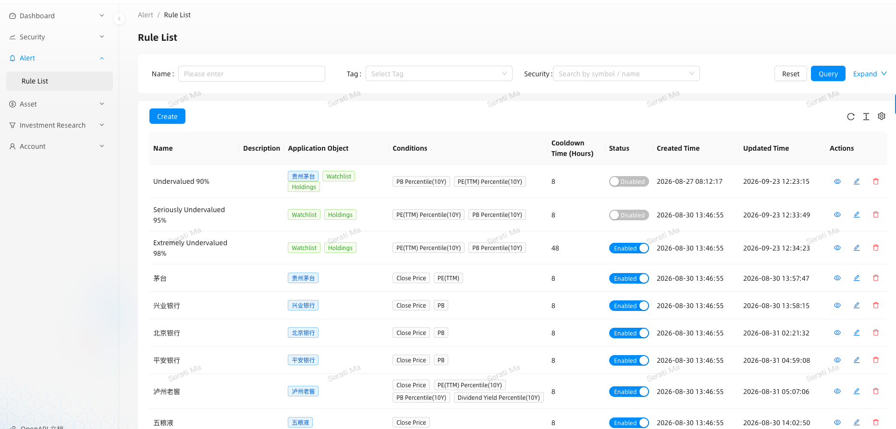
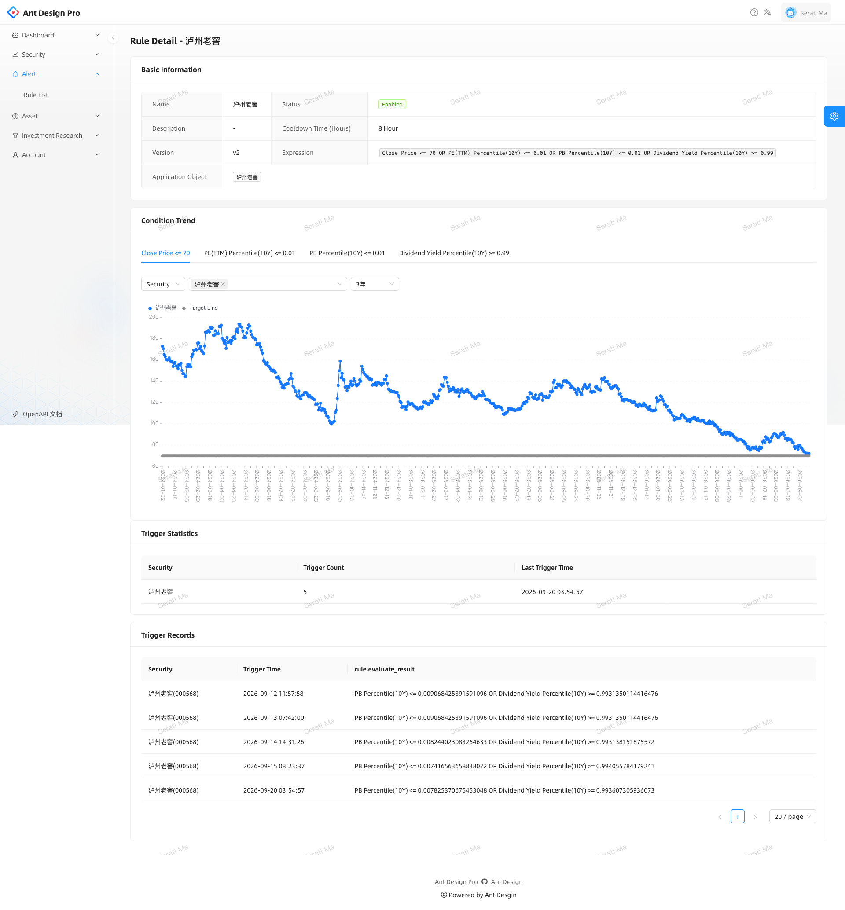

[TOC]

# investment-platform

A personal investment research platform for fundamental and value-oriented equity research.

The platform integrates:

- **Financial Data** — multi-source market and fundamental data collection
- **Factor Engine** — fundamental, valuation, and derived factors
- **Custom Research Indicators** — user-defined indicators for screening, stock comparison, and alerts
- **Event & Alerts** — event-driven investment rule processing
- **Research Console** — screening, scoring, comparison, and research workflows


```
Financial Sources 
        │ 
        ▼ 
┌─────────────────┐ 
│ Data Collection │ ← fin-data-kit 
└────────┬────────┘ 
         ▼ 
┌─────────────────┐ 
│ MySQL / 
│                 
│ ClickHouse      │ 
└────────┬────────┘ 
         ▼ 
┌─────────────────┐ 
│ Factor Engine   │ 
│ Factor DAG      │ 
└────────┬────────┘ 
         │ Kafka 
         ▼ 
┌─────────────────┐ 
│ Event Processing│ ← eventflow 
└────────┬────────┘ 
         ▼ 
┌─────────────────┐ 
│ Research Console│ 
│ Screening       │ 
│ Scoring         │ 
│ Comparison      │ 
│ Alerts          │ 
└─────────────────┘
```

> It is **Private project.** The core application is not open-sourced. Reusable infrastructure extracted from the platform is available as independent open-source projects.

**Open-source infrastructure**


- [daokit](https://github.com/lanlingshao/daokit)
- [fin-data-kit](https://github.com/lanlingshao/fin-data-kit)
- [eventflow](https://github.com/lanlingshao/eventflow)

---
## System Architecture

The platform is organized into several major subsystems:



The architecture separates infrastructure concerns from investment-specific business logic.


## Core Components
### 1. Financial Data Collection

The data collection subsystem is built on top of [fin-data-kit](https://github.com/lanlingshao/fin-data-kit).

It collects and normalizes financial market data from multiple sources, including:
- Daily market data
- Financial statements
- Share capital data
- Stock lists and security metadata
- Trading calendars
- Other fundamental and market data

The application declares the required data capabilities rather than directly depending on a specific data provider.

For example:
```
Application 
    │ 
    │ request: daily_kline 
    ▼ fin-data-kit 
    │ 
    ├── Primary Source 
    │ 
    ├── Fallback Source 
    │ 
    ├── Rate Limiting 
    │ 
    └── Retry 
    │ 
    ▼ Financial Data
```

This allows data sources to be changed or extended without coupling the research application to a specific provider.

**Key characteristics**
- Multiple data sources
- Capability-oriented data access
- Configurable source priority
- Rate limiting
- Automatic retry
- Source fallback
- Unified data interfaces
- Asynchronous data collection

### 2. Factor Computation Engine
The factor engine is the core quantitative research component of the platform.

It computes fundamental and valuation indicators such as:
- PE
- PB
- ROE
- Dividend Yield
- Earnings-related indicators
- Valuation percentiles
- Other derived investment factors

The engine uses a DAG-based dependency model to represent relationships between factors.

For example:

```
Financial Statements 
        │ 
        ├───────────────┐ 
        ▼               ▼ 
     Net Income       Equity 
        │               │ 
        └───────┬───────┘ 
                ▼ ROE 
                │ 
                ▼ 
        Historical ROE Analysis 
        
Market Data ──────────────┐ 
                          ▼ 
                  Valuation Factors 
                          │ 
              ┌───────────┴───────────┐ 
              ▼                       ▼ 
              PE                     PB 
              │                       │ 
              └───────────┬───────────┘ 
                          ▼ 
                 Valuation Percentile
```

The DAG allows dependent factors to be calculated in the correct order while avoiding unnecessary duplicate computation.

The factor engine is intentionally kept inside the private project because it contains investment-specific research logic.

### 3. Event & Alert System

The alert subsystem connects the data pipeline and factor engine with investment rules.

The event flow is approximately:
```
Data Collection 
        │ 
        │ Kafka Event 
        ▼ 
┌───────────────┐ 
│ Event System  │ 
└───────┬───────┘ 
        │ 
        ▼ 
┌───────────────┐ 
│ Rule Engine   │ 
└───────┬───────┘ 
        │ 
        ├── Stock Rules 
        │ 
        ├── Tag Rules 
        │ 
        └── Indicator Conditions 
        │ 
        ▼ Alert
```

The event processing layer is built on top of the open-source [eventflow](https://github.com/lanlingshao/eventflow) framework.

The application-specific rule engine evaluates investment conditions based on incoming events.

Examples include:
- valuation threshold alerts
- factor threshold alerts
- indicator trend conditions
- stock-specific rules
- tag-based rules

The separation between event transport and investment rules allows the event infrastructure to remain reusable while investment logic stays within the application.

### 4. Investment Research Console

The research console provides the main interface for interacting with the investment research system.

**Research Tags**

Stocks can be organized using research-oriented tags.

Examples include:

- Industry leaders
- Companies with strong competitive advantages
- Pricing power
- High-ROE Companies
- Watchlist
- Holdings
- Intended purchase list

Tags can also be used as inputs to screening and alert rules.

---

**Stock Scoring**

The platform supports stock scoring and research indicators.

The scoring system allows qualitative investment research to be combined with quantitative indicators.

For example:
```
Company 
    │ 
    ├── Financial Indicators 
    ├── Valuation Indicators 
    ├── Research Tags 
    └── Manual Score 
              │ 
              ▼ 
       Investment View
```

---

**Custom Research Indicators**

The indicator system supports both system-defined and user-defined research indicators.

System indicators are generated from the factor engine, while user-defined indicators can be constructed from existing data and mathematical expressions.

```text
                    Research Indicators
                           │
             ┌─────────────┼─────────────┐
             ▼             ▼             ▼
        Stock Screener   Stock PK     Alert Rules
```

For example:
```
Financial Indicators
        +
Valuation Indicators
        +
User-defined Expressions
        │
        ▼
Custom Research Indicator
        │
        ├── Stock Screening
        ├── Stock Comparison
        └── Alert Rules
```

This allows an investment idea to be expressed as a reusable, computable research indicator rather than remaining only as a manual observation.

The same indicator can then be reused across different research workflows, including screening, stock comparison, and alert monitoring.

--- 

**Stock Screener**

The stock screener supports filtering stocks using combinations of:

- Industry
- Research Tags
- Scores
- Valuation indicators
- Financial indicators
- User-defined indicators

Example:
```
Industry 
    AND 
ROE > threshold 
    AND 
PB < threshold 
    AND 
PE percentile < threshold 
    AND 
Dividend Yield > threshold
```

The purpose is to transform investment ideas into explicit, repeatable screening conditions.

---

**Stock Comparison**

The platform provides a stock comparison interface for comparing companies across multiple indicators.

Typical comparison dimensions include:

- Valuation
- Profitability
- Growth
- Dividends
- Financial quality
- Historical indicators

This is intended to support comparative research rather than replacing fundamental investment analysis.

---

**Alerts**

The alert interface allows investment rules to be configured and monitored.

Rules can reference:

- stocks
- tags
- indicators
- indicator trends
- valuation conditions

The system evaluates these rules against events generated by the data and factor pipelines.

---

## Task Scheduling

Data collection and factor computation tasks are orchestrated using [Prefect](https://www.prefect.io/).

Typical workflows include:
```
Trading Calendar 
        │ 
        ▼ 
Data Collection 
        │ 
        ▼ 
Financial Data Update 
        │ 
        ▼ 
Factor Computation 
        │ 
        ▼ 
Factor Snapshot 
        │ 
        ▼ 
Event / Alert Processing
```

The scheduling layer is responsible for:
- periodic data collection
- factor computation
- task dependencies
- retries
- workflow execution
- historical backfills
- scheduled and manual execution

This separates workflow orchestration from the business logic implemented by the individual services.

---

## Open-source Infrastructure

Several reusable infrastructure components were extracted from the platform and developed as independent open-source projects.

### daokit

**Asynchronous data-access toolkit for MySQL and ClickHouse**

*daokit* is an asynchronous data-access toolkit built on SQLAlchemy, asyncmy, asynch, and clickhouse-connect.

It provides reusable DAO base classes and database clients while leaving application-specific query rules in small, explicit DAO subclasses.

Repository:

[https://github.com/lanlingshao/daokit](https://github.com/lanlingshao/daokit)

---

### fin-data-kit

**Asynchronous financial data collection framework.**

*fin-data-kit* is an asynchronous framework for collecting financial data.

Callers declare the capabilities they require, while the framework handles:

- data source selection
- source priority
- rate limiting
- retries
- source fallback
- asynchronous execution

Repository:

[https://github.com/lanlingshao/fin-data-kit](https://github.com/lanlingshao/fin-data-kit)

---

### eventflow

**Asynchronous event-dispatching framework for Python and Kafka.**

*eventflow* separates:

- event production
- broker consumption
- batch processing
- failure handling

Applications can therefore focus on business event handlers without embedding Kafka-specific infrastructure throughout the application.

Repository:

[https://github.com/lanlingshao/eventflow](https://github.com/lanlingshao/eventflow)


---

## Screenshots

### Investment Research Console



---

### Stock Screening



---
### Stock Comparison




---
### Alert Rules




## Engineering Highlights

### Financial data infrastructure

Designed a multi-source asynchronous financial data collection layer with source selection, rate limiting, retry, and fallback mechanisms.

### Factor dependency management

Built a factor computation engine based on DAG dependencies to represent relationships between financial and valuation indicators and avoid unnecessary duplicate computation.

### Event-driven architecture

Connected data collection and factor computation with an asynchronous Kafka event pipeline, separating event infrastructure from investment-specific rule processing.

### Research-oriented domain modeling

Modeled investment concepts such as:

- tags
- scores
- indicators
- screening conditions
- alert rules
- stock comparison

as explicit domain concepts rather than embedding them directly into UI logic.

### Workflow orchestration

Used Prefect to orchestrate data collection, factor computation, backfills, and scheduled research workflows.

### Separation of infrastructure and investment logic

Reusable infrastructure has been extracted into independent open-source projects, while investment-specific factor logic, rule logic, and research workflows remain within the private application.

### Technology Stack

| Layer                  | Technology                                          |
| ---------------------- | --------------------------------------------------- |
| Language               | Python                                              |
| API                    | FastAPI                                             |
| Database               | MySQL                                               |
| Analytical Database    | ClickHouse                                          |
| Cache                  | Redis                                               |
| Message Broker         | Kafka                                               |
| Event Processing       | eventflow                                           |
| Data Access            | SQLAlchemy / asyncmy / clickhouse-connect / daokit  |
| Data Collection        | fin-data-kit                                        |
| Workflow Orchestration | Prefect                                             |
| Frontend               | React / Ant Design                                  |
| Reverse Proxy          | Nginx                                               |

---

## Project Structure

The private application is organized around several major domains:

```
investment-platform/ 
│ 
├── data/ 
│   └── financial data collection 
│ 
├── factor/ 
│   └── factor computation engine 
│ 
├── event/ 
│   └── event processing and alerts 
│ 
├── rule/ 
│   └── investment rule engine 
│ 
├── research/ 
│   └── research domain services 
│   
├── admin/ 
│   └── investment research console 
│ 
└── workflow/ 
    └── Prefect workflows
```

The exact implementation is intentionally not included in this repository.

--- 

## Project Status

The platform is an ongoing personal research system.

Current capabilities include:

- Multi-source financial data collection
- Financial data storage
- Fundamental and valuation factor computation
- Factor dependency DAG
- Kafka-based event processing
- Stock and tag-based alert rules
- Investment research tags
- Stock scoring
- Research indicators
- Stock screening
- Stock comparison
- Scheduled and manual workflows

The system continues to evolve as new research requirements are identified.

---

## Future Roadmap

The platform is continuously evolving as new research requirements are identified.

Planned areas include:

* **Company Research** — structured company research, business quality, competitive advantages, management, and other qualitative research dimensions
* **Industry Research** — industry structure, industry trends, competitive landscape, and industry-level analysis
* **Financial Report Research** — deeper analysis of financial statements and earnings reports
* **AI-assisted Research** — using AI to improve financial data interpretation, company research, report analysis, and research workflow efficiency

The long-term goal is to combine **structured financial data, quantitative indicators, qualitative research, and AI-assisted workflows** into a unified investment research system.

---

## Open-source Philosophy

The platform itself is a domain-specific investment research application, while several infrastructure components have been extracted into independent libraries.

This separation allows reusable engineering components to evolve independently from investment-specific research logic.

Open-source projects:

- [daokit](https://github.com/lanlingshao/daokit)
- [fin-data-kit](https://github.com/lanlingshao/fin-data-kit)
- [eventflow](https://github.com/lanlingshao/eventflow)

The private application demonstrates how these infrastructure components can be composed into a larger financial research system.